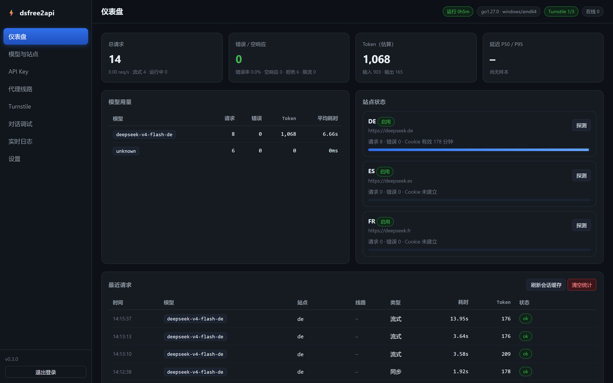
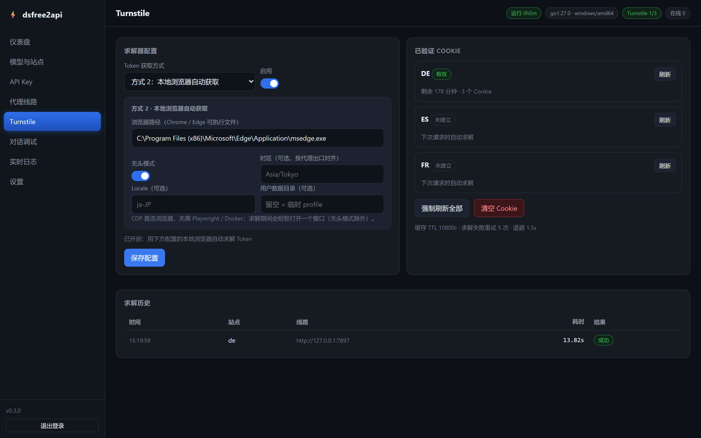
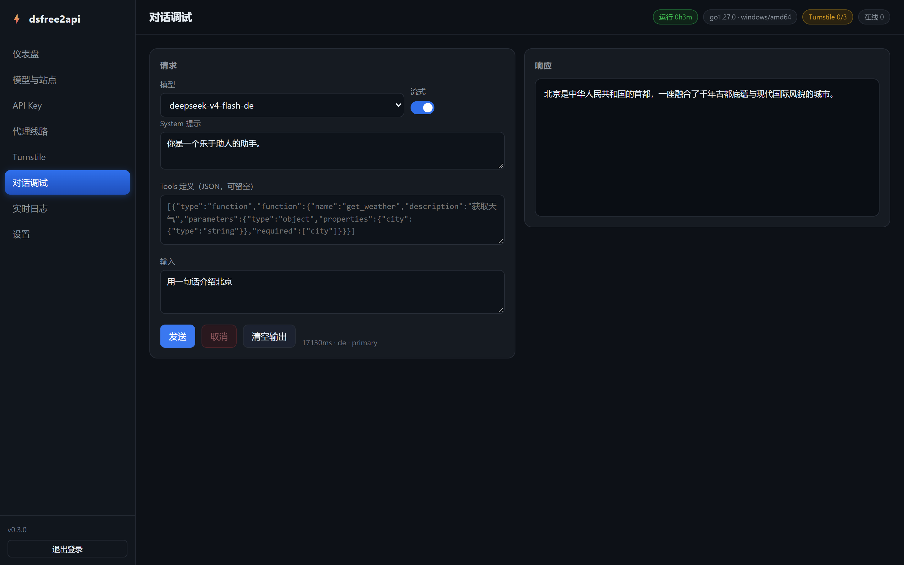
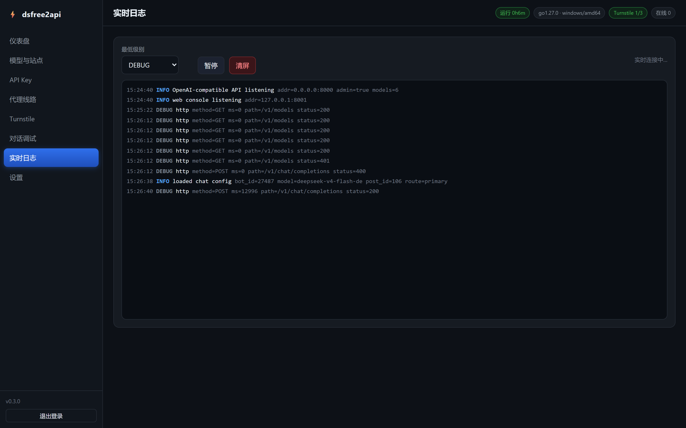

# dsfree2api

[](https://go.dev)
[](./LICENSE)
[](./docker-compose.yml)

逆向 **deepseek.de / deepseek.es / deepseek.fr** 三个站点的 V4-Flash / V4-Pro 模型，提供 **OpenAI API 完全兼容** 的中转服务。

Go 实现，编译为**单个静态二进制**，无运行时依赖；内置 **Web 管理控制台**（模型 / Key / 代理 / Turnstile / 日志 / 调试）。

> ⚠️ 这些站点并非 DeepSeek 官方网站，请谨慎使用。

---

## 目录

- [功能特性](#功能特性)
- [界面预览](#界面预览)
- [模型映射](#模型映射)
- [快速开始](#快速开始)
- [配置](#配置)
- [API 用法](#api-用法)
- [Web 管理台](#web-管理台)
- [环境变量](#环境变量)
- [架构](#架构)
- [开发](#开发)
- [免责声明](#免责声明)

---

## 功能特性

- **多格式对话接口**：`POST /v1/chat/completions`（OpenAI，流式 / 非流式）、`POST /v1/responses`（OpenAI Responses）、`POST /v1/messages`（Anthropic Messages）、`GET /v1/models`、`GET /health`
- **Tool Calling**：三个对话端点均支持 `tools` / `tool_choice`，模型以 JSON 输出 tool_calls，自动回填到响应（`tool_calls` / `function_call` / `tool_use`）；回复被上游输出上限截断时自动多轮续写拼接（`continue_rounds`），仍不闭合则在截断处就近补全为部分工具调用返回，由客户端下一轮继续写
- **三站点聚合**：单站点每日额度耗尽自动切换到其他站点的同款模型，额度耗尽的站点临时降级 10 分钟
- **站点额度管理**：额度按访客身份按日计算，控制台站点卡片可一键查询当前额度、重置访客身份（等同新开隐私窗口、额度即刻回满）；请求撞额度时也会自动轮换访客身份恢复，无需重新求解
- **代理线路**：主线路 + 多条备用线路，支持 `http://` `https://` `socks5://`；slow-start 检测 + 失败降级 + 流中失败不重放
- **代理池**：Xray 核心（分享链接 / 订阅 / `ip:port` 端点；核心可自动下载）+ 粘性选路 + 后台健康探测；每个站点可绑定独立出口，Turnstile 求解与请求共用同一出口
- **Turnstile 自动突破**：三种 Token 获取方式 — 求解服务 API（`provider="api"`）、本地浏览器自动求解（`provider="browser"`，CDP 直连 Chrome/Edge，无需 Playwright/Docker）、手动导入 Cookie（`provider="manual"`）；结果按「代理线路 × 站点」缓存，TTL 过期自动重解
- **会话自愈**：nonce / data-config 缓存 + 配额耗尽 / 验证失败时自动刷新重试
- **Web 管理台**：仪表盘、模型与站点、API Key、代理线路、Turnstile、对话调试、实时日志、设置
- **可观测**：按模型 / 站点 / 按日统计、P50/P95 延迟、最近请求、实时日志（SSE）、文件日志按日压缩轮转，数据持久化到 `data/`
- **安全**：下游 Bearer / `X-Api-Key` 鉴权、每 Key 每分钟限流、每站点并发闸门、管理台独立口令

---

## 界面预览

| 仪表盘 | Turnstile |
|--------|-----------|
|  |  |
| **对话调试** | **实时日志** |
|  |  |

---

## 模型映射

共 **6 个模型**，分布在三个欧洲站点：

| 模型 ID | 站点 | 对应模型 | bot_id | post_id |
|---------|------|---------|--------|---------|
| `deepseek-v4-flash-de` | deepseek.de | V4-Flash | 27487 | 106 |
| `deepseek-v4-pro-de` | deepseek.de | V4-Pro | 27533 | 27177 |
| `deepseek-v4-flash-es` | deepseek.es | V4-Flash | 27623 | 27568 |
| `deepseek-v4-pro-es` | deepseek.es | V4-Pro | 27637 | 27615 |
| `deepseek-v4-flash-fr` | deepseek.fr | V4-Flash | 27645 | 27569 |
| `deepseek-v4-pro-fr` | deepseek.fr | V4-Pro | 27647 | 27616 |

> 三个站点各自有独立配额，聚合后每日可用 token 约 3 倍。

---

## 快速开始

### 方式一：源码运行

需要 Go ≥ 1.27。

```bash
cp config.example.toml config.toml
$EDITOR config.toml          # Turnstile 默认关闭；启用时按 provider 填 api_key 或 browser_path

go run ./cmd/dsfree2api -config config.toml
```

### 方式二：编译单文件二进制

```bash
make build                   # 本机 → bin/dsfree2api
make linux                   # linux/amd64 静态二进制 → bin/dsfree2api-linux-amd64
```

部署到服务器：

```bash
scp bin/dsfree2api-linux-amd64 user@host:/opt/dsfree2api/dsfree2api
ssh user@host '/opt/dsfree2api/dsfree2api -config /opt/dsfree2api/config.toml'
```

> 二进制不带任何运行时依赖（`CGO_ENABLED=0`），无需安装 Python / glibc / libcurl。

### 方式三：Docker

```bash
cp config.example.toml config.toml
docker compose up -d --build
```

容器内监听 `8000`（API）与 `8001`（管理台），数据卷挂在 `./data`。

### 验证

```bash
curl http://127.0.0.1:8000/health
curl http://127.0.0.1:8000/v1/models -H "Authorization: Bearer sk-你的key"
```

---

## 配置

配置文件是 TOML，结构见 [`config.example.toml`](./config.example.toml)（含全部字段注释）。

- 不存在该文件时按内置默认值启动
- **环境变量优先级高于配置文件**
- 通过管理台或 `PUT /api/config` 修改会**自动写回** `config.toml`（旧文件备份为 `config.toml.bak`）
- 启动时可用 `-check` 只校验配置：

```bash
dsfree2api -config config.toml -check
```

### 常用字段

| 字段 | 说明 |
|------|------|
| `[server]` | API 监听 `host` / `port` / `log_level` / `log_file`（留空写数据目录，按日压缩轮转；`-` = 仅终端） |
| `[security].api_keys` | 下游鉴权，空数组 = 不鉴权 |
| `[admin]` | 管理台 `enabled` / `host` / `port` / `password`（留空启动时生成随机密码） |
| `[limits]` | `max_concurrent_per_site` 每站点并发、`rate_per_minute` 每 Key 每分钟限流（0 = 不限） |
| `[proxy]` | `url` 主线路、`fallback_urls` 备用线路、`slow_start_seconds` 首事件超时 |
| `[proxypool]` | 代理池总开关、健康检查间隔 / 超时 / URL、裸 `ip:port` 默认协议、Xray 路径 / 版本 / 自动下载；`[proxypool.entries.*]` 手动节点（分享链接或端点）、`[proxypool.subscriptions.*]` 订阅自动拉取 |
| `[quota]` | 配额哨兵：`enabled` / `check_seconds` / `warn_ratio`，定期用池内会话读取站点免费额度，低额告警与重置留档 |
| `[upstream]` | 超时、配置缓存 TTL、会话自动刷新、`cross_site_failover` 跨站切换、`continue_rounds` 工具调用截断续写轮数（0 = 不续写、直接截断补全） |
| `[turnstile]` | **默认 `enabled = false` 且不内置任何求解服务**；`provider` 三选一：`api`（填 `api_url` / `api_key`）、`browser`（填 `browser_path` 指向本机 Chrome/Edge）、`manual`（只用控制台导入的 Cookie），另有 Cookie TTL、重试次数、单次求解超时（`timeout_seconds`）与 Cookie 池（`warm_enabled` / `warm_ratio` / `warm_check_seconds`，后台预热，请求零等待） |
| `[sites.*]` | 三个站点的 `base_url` / `ajax_url` / `sitekey` / `language` / `proxies`（站点级出口绑定，按顺序粘性选路） |
| `[models.*]` | 模型到 `site` + `upstream_id` + `bot_id` / `post_id` 的映射 |

### Turnstile 说明

站点在发消息前会校验 Turnstile（`ts_required`），`[turnstile]` 默认关闭时不会自动求解。`provider` 决定 Token / Cookie 的获取方式，三选一：

| provider | 方式 | 需要配置 | 说明 |
|----------|------|----------|------|
| `api`（默认） | 1 · 求解服务 API | `api_url` + `api_key` | 把站点 + sitekey 交给你的求解服务，返回 Token 后由本程序完成站点验证（**默认不预置任何求解地址**，空地址开启会被拒绝） |
| `browser` | 2 · 本地浏览器自动获取 | `browser_path` | CDP 直连你配置的 Chrome / Edge：打开站点 → 注入 Turnstile widget → 可信点击 → 轮询拿到 Token；等价于 heartmore/cloudflare-solver 的做法，但**无需 Playwright / FlareSolverr / Docker**，单二进制即可。可选 `browser_user_data_dir`（真实 profile）、`browser_timezone` / `browser_locale`（对齐代理出口） |
| `manual` | 3 · 手动导入 Cookie | — | 不自动求解，只使用控制台导入的 Cookie |

- **手动导入 Cookie**：在走同一条出口线路的浏览器里过一次验证，把 `document.cookie` 粘到控制台 **Turnstile → 手动导入 Cookie**，在 `cookie_ttl_seconds` 内免求解（Cookie 与出口 IP / UA 绑定，换线路需重新导入）；
- **浏览器模式提示**：求解期间会短暂弹出浏览器窗口（`browser_headless = true` 可关闭，但过验证率更低）；带账号密码的代理暂不支持 Chrome，请用 IP 白名单代理；浏览器被系统策略锁定时会报 `browser launch failed` 并附 stderr。

> `deepseek.fr` / `deepseek.es` 对中国 IP 会 302 到 `deepseek.com`，需给 `[proxy].url` 配一条境外线路（如本机 `http://127.0.0.1:7897`），`deepseek.de` 不受影响。

---

## API 用法

### 非流式

```bash
curl http://127.0.0.1:8000/v1/chat/completions \
  -H "Authorization: Bearer sk-你的key" \
  -H "Content-Type: application/json" \
  -d '{
    "model": "deepseek-v4-flash-fr",
    "messages": [{"role": "user", "content": "你好"}],
    "stream": false
  }'
```

### 流式

```bash
curl -N http://127.0.0.1:8000/v1/chat/completions \
  -H "Authorization: Bearer sk-你的key" \
  -H "Content-Type: application/json" \
  -d '{"model":"deepseek-v4-flash-fr","messages":[{"role":"user","content":"你好"}],"stream":true}'
```

### OpenAI SDK

```python
from openai import OpenAI

client = OpenAI(base_url="http://127.0.0.1:8000/v1", api_key="sk-你的key")

stream = client.chat.completions.create(
    model="deepseek-v4-flash-fr",
    messages=[{"role": "user", "content": "写一首五言绝句"}],
    stream=True,
)
for chunk in stream:
    print(chunk.choices[0].delta.content or "", end="")
```

### Tool Calling

请求里带 `tools` 即可，模型会返回 `tool_calls`：

```json
{
  "model": "deepseek-v4-pro-fr",
  "messages": [{"role": "user", "content": "北京天气怎么样？"}],
  "tools": [{
    "type": "function",
    "function": {
      "name": "get_weather",
      "description": "获取城市天气",
      "parameters": {
        "type": "object",
        "properties": {"city": {"type": "string"}},
        "required": ["city"]
      }
    }
  }]
}
```

> 只有请求带 `tools` 时才会缓冲并输出 `tool_calls`，普通对话不受影响。

### Anthropic Messages（Claude Code 等）

`POST /v1/messages` 接受 Anthropic Messages 格式（`system`、content blocks、`tools.input_schema`、`tool_choice`、流式 SSE `message_start` → `content_block_*` → `message_stop`），错误返回 `{"type":"error","error":{...}}` Anthropic 格式：

```bash
curl http://127.0.0.1:8000/v1/messages \
  -H "x-api-key: sk-你的key" \
  -H "anthropic-version: 2023-06-01" \
  -H "Content-Type: application/json" \
  -d '{
    "model": "deepseek-v4-flash-fr",
    "max_tokens": 1024,
    "messages": [{"role": "user", "content": "你好"}]
  }'
```

带 `tools` 时返回 `tool_use` content block（`stop_reason: "tool_use"`），多轮 `tool_result` 会回填为工具结果。

### 其它端点

| 端点 | 说明 |
|------|------|
| `POST /v1/messages` | Anthropic Messages API（流式 / 非流式、tool_use；错误为 Anthropic 格式） |
| `POST /v1/responses` | OpenAI Responses API（流式错误会发 `response.failed`，支持 `tools` → `function_call`） |
| `GET /v1/models` | 模型列表（需鉴权） |
| `GET /health` | 存活状态 + 模型/站点/Turnstile 概况（免鉴权） |
| `GET /` | 服务信息（免鉴权） |

---

## Web 管理台

默认监听 `http://127.0.0.1:8001`。

| 页面 | 功能 |
|------|------|
| 仪表盘 | 请求数 / 错误 / Token / P50·P95、模型用量、站点状态（含 Cookie TTL 进度条）、最近请求 |
| 模型与站点 | 编辑标签、路径、bot_id/post_id，启停模型与站点，修改站点 URL / 语言 |
| API Key | 生成 / 删除 / 复制下游 key，立即写回配置 |
| 代理线路 | 主线路、备用线路增删、连通性测试、slow-start / 并发 / 限流 / 跨站切换、代理池（节点 / 订阅 / 每站点绑定 / Xray 核心状态） |
| Turnstile | 三种 Token 获取方式的模式面板（求解服务 API / 本地浏览器自动获取 / 手动导入 Cookie）、各站 Cookie 状态与 TTL、强制刷新、求解历史 |
| 对话调试 | 选模型 / 系统提示 / tools JSON，流式或非流式，带连接计时与取消 |
| 实时日志 | 级别过滤 + SSE 实时推送 |
| 设置 | 服务与上游参数、数据目录、危险操作 |

- 登录口令取自 `[admin].password`；未配置时启动日志会打印**一次性随机密码**
- 鉴权通过 Cookie `dsfr_admin`，也可用 `X-Admin-Token` / `Authorization: Bearer <token>`
- 生产环境请将管理台置于反向代理后（默认只绑定 `127.0.0.1`）

---

## 环境变量

| 变量 | 说明 | 默认 |
|------|------|------|
| `HOST` / `PORT` | API 监听地址 | `0.0.0.0` / `8000` |
| `LOG_LEVEL` | `DEBUG` `INFO` `WARN` `ERROR` | `INFO` |
| `LOG_FILE` | 日志文件路径；留空 = `<data_dir>/logs/dsfree2api.log`，`-` = 仅终端 | —（文件日志） |
| `API_KEYS` | 下游 key，逗号分隔 | —（不鉴权） |
| `PROXY_URL` | 主代理 | —（直连） |
| `PROXY_FALLBACK_URLS` | 备用代理，逗号分隔 | — |
| `PROXY_SLOW_START_SECONDS` | 首事件超时秒数 | `8` |
| `TURNSTILE_ENABLED` | Turnstile 开关（`true`/`false`） | `false` |
| `TURNSTILE_API_KEY` | Turnstile 求解服务 key（仅在 `provider=api` 且开启时校验） | 配置文件 |
| `TURNSTILE_PROVIDER` | Token 获取方式：`api` / `browser` / `manual` | `api` |
| `TURNSTILE_BROWSER_PATH` | 浏览器模式的 Chrome / Edge 可执行文件路径 | — |
| `ADMIN_ENABLED` / `ADMIN_HOST` / `ADMIN_PORT` / `ADMIN_PASSWORD` | 管理台 | `true` / `127.0.0.1` / `8001` |
| `DATA_DIR` | 统计等运行时数据目录 | `./data` |

---

## 架构

```
cmd/dsfree2api        入口：配置加载、日志、双 HTTP server、优雅退出
internal/config       TOML 结构 + 默认值 + env 覆盖 + 校验 + 写回
internal/httpx        TLS 指纹会话封装（bogdanfinn/tls-client, Chrome_120）
internal/proxypool    代理池：Xray 核心管理 / 订阅拉取 / 分享链接解析 / 粘性选路与健康探测
internal/openai       OpenAI 协议类型、prompt 拼接、tool_calls 解析
internal/anthropic    Anthropic Messages 协议类型 + 与 OpenAI 消息的互转
internal/turnstile    Turnstile 三种求解方式（API / 浏览器 CDP / 手动）+ 按线路/站点的 Cookie 缓存
internal/upstream     上游逆向核心：data-config/nonce → SSE → 事件翻译，
                      线路降级、慢启动、会话刷新、跨站切换
internal/api          OpenAI / Anthropic 路由、鉴权、限流、流式写出
internal/admin        管理台后端 + go:embed 前端
internal/metrics      计数/分模型/分站点/按日/延迟分位数，JSON 持久化
internal/logbuf       环形日志 + 订阅广播（供 SSE 日志页）
```

---

## 开发

```bash
make fmt      # gofmt -w .
make vet      # go vet ./...
make test     # go test ./...
make check    # 以上全部
make linux    # 交叉编译静态 linux 二进制
```

命令行参数：

```
-config  配置文件路径（默认 config.toml）
-host    覆盖监听地址
-port    覆盖监听端口
-check   只校验配置后退出
-version 打印版本
```

---

## 免责声明

本项目仅供学习与研究网络协议使用，所对接站点与 DeepSeek 官方无关。使用者需自行承担因使用本项目产生的一切责任与后果。
